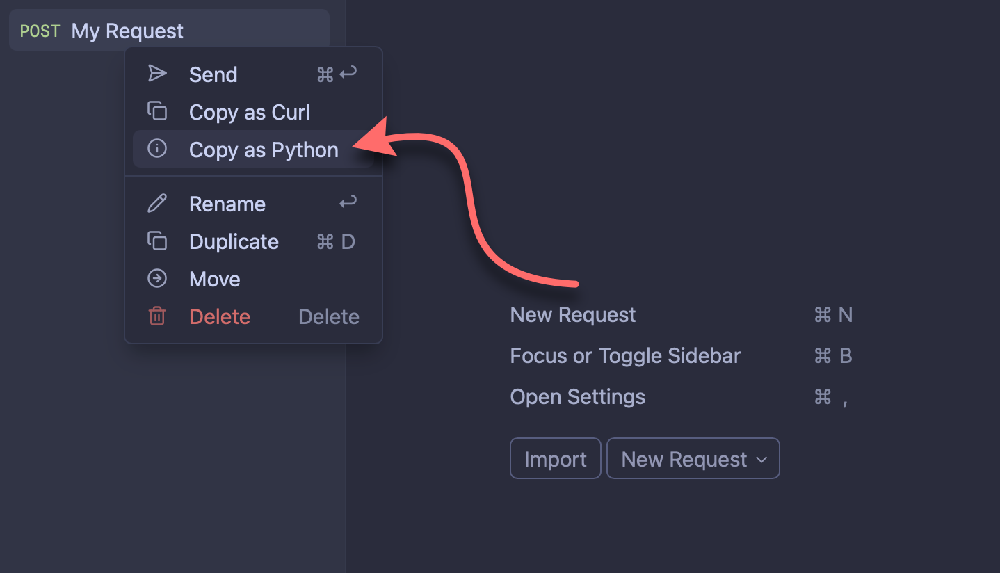

# Copy as Python

A request action plugin for Yaak that converts HTTP requests into [python](https://python.org)
code, making it easy to share, debug, and execute requests outside Yaak.



## Overview

This plugin adds a 'Copy as Python' action to HTTP requests, converting any request into its
equivalent python code. This is useful for debugging, sharing requests with team members,
and executing requests in terminal environments where `python` is available.

## How It Works

The plugin analyzes the given HTTP request and generates properly formatted python code
that includes:

- HTTP method (GET, POST, PUT, DELETE, etc.)
- Request URL with query parameters
- Headers (including authentication headers)
- Request body (for POST, PUT, PATCH requests)
- Authentication credentials

## Usage

1. Configure an HTTP request as usual in Yaak
2. Right-click on the request in the sidebar
3. Select 'Copy as Python'
4. The code is copied to your clipboard
5. Share or execute the code

## Generated Python Examples

### Simple GET Request

```python
import requests

url = 'https://api.example.com/users'

response = requests.get(url)
print(response.json())
```

### POST Request with JSON Data

```python
import requests

url = 'https://api.example.com/users'
headers = {'Content-Type': 'application/json'}
payload = {'name': 'John Doe', 'email': 'john@example.com'}

response = requests.post(url, headers=headers, json=payload)
print(response.json())
```

### Request with Multi-part Form Data

```python
import requests

url = 'yaak.app'
headers = {}
payload = {'hello': 'world'}
files = { 'file': ('file.json', open('/path/to/file.json', 'rb')) }

response = requests.post(url, files=files, data=payload)
print(response.json())
```

### Request with Authentication

```python
import requests

url = 'https://api.example.com/protected'

response = requests.get(url, auth=('username', 'password'))
print(response.json())
```